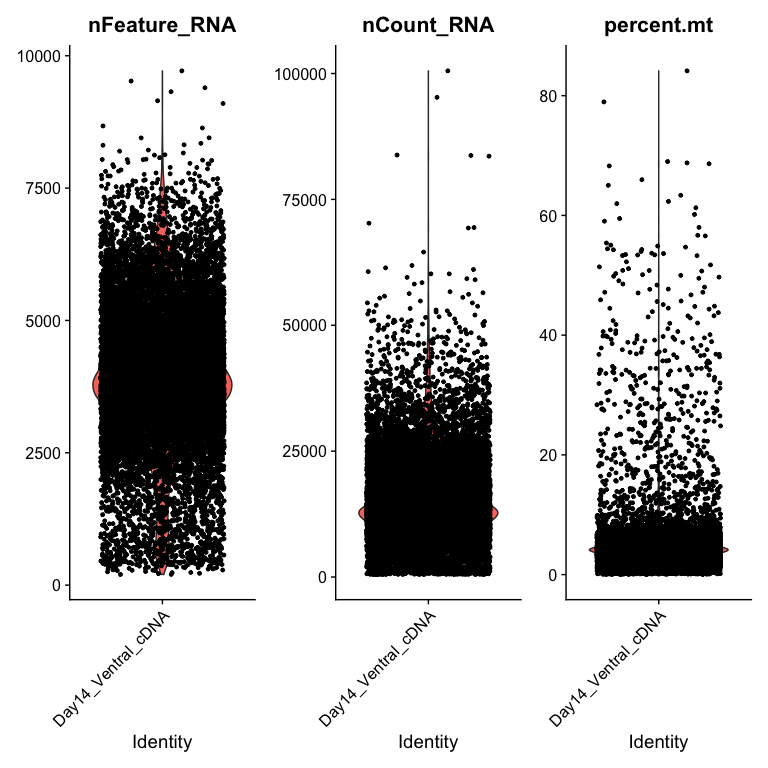
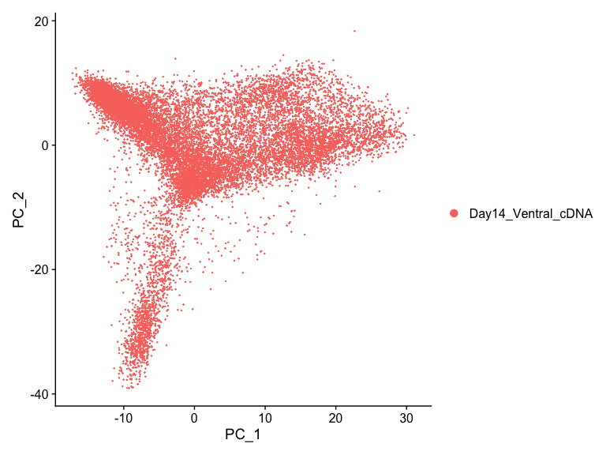
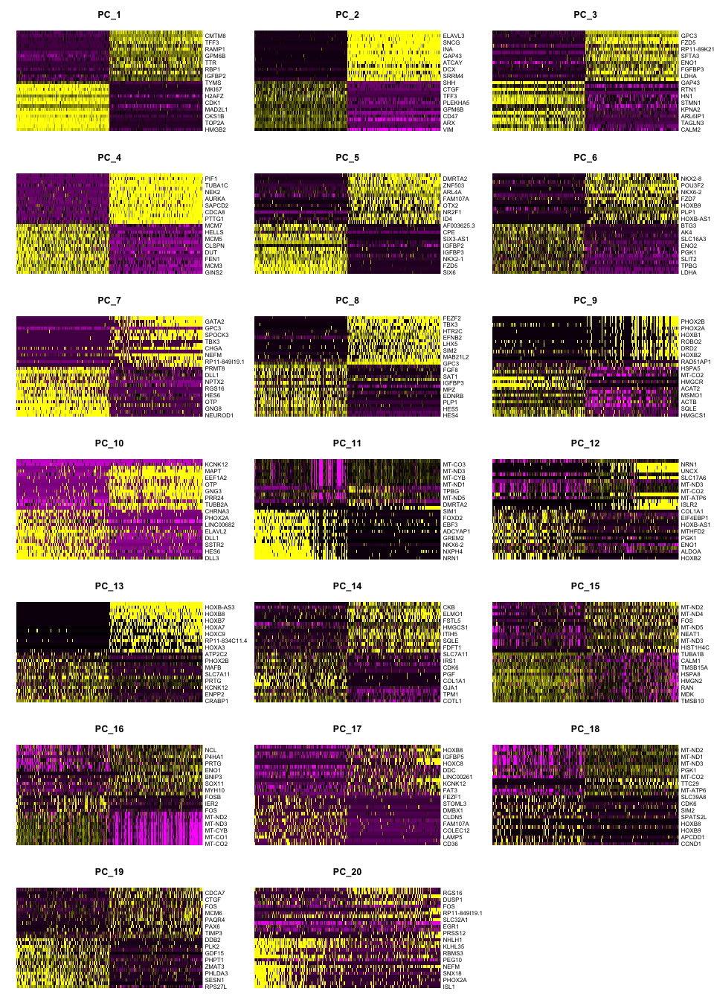
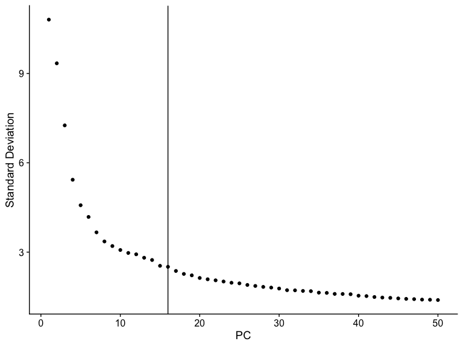
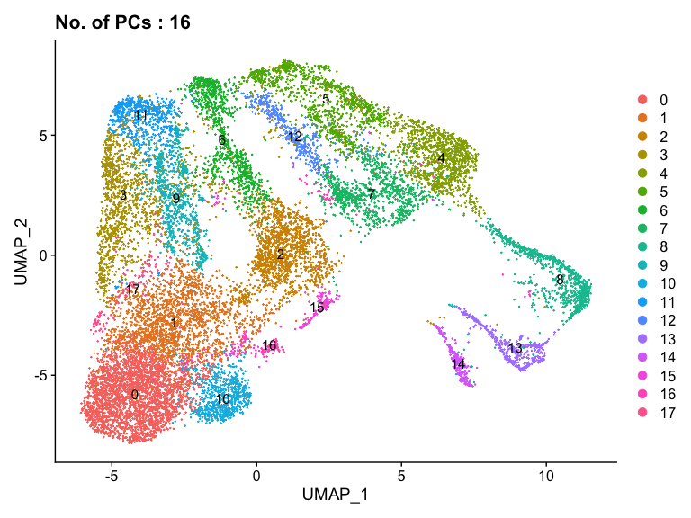
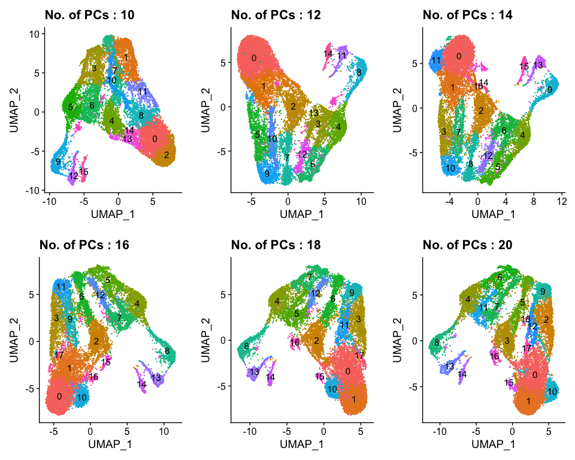
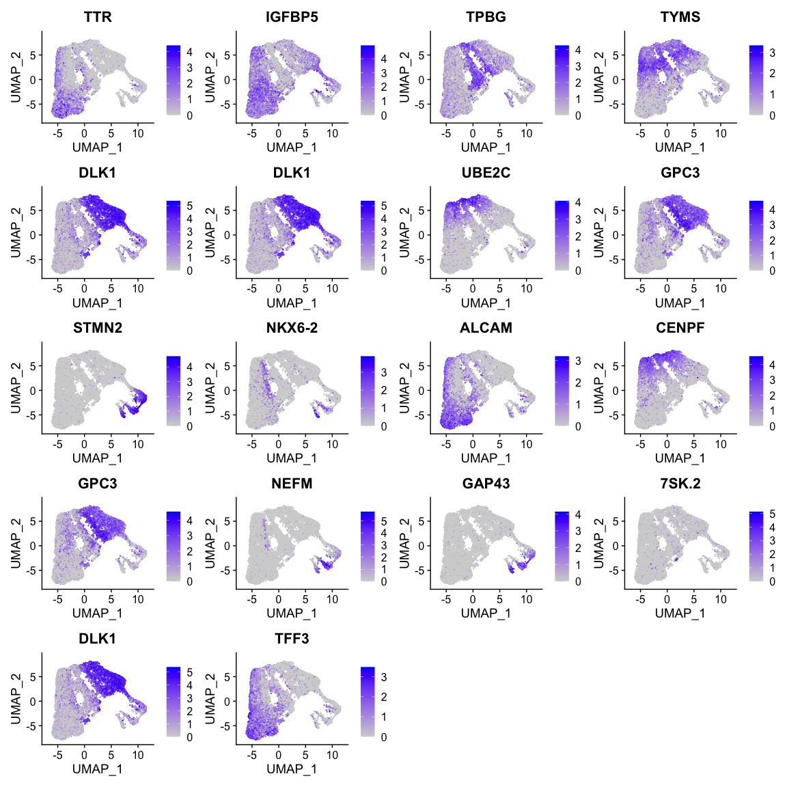
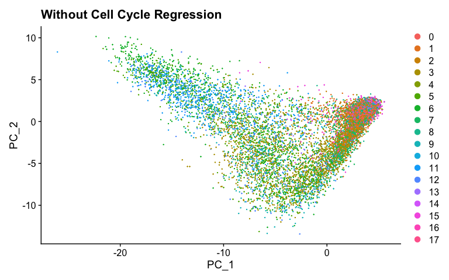
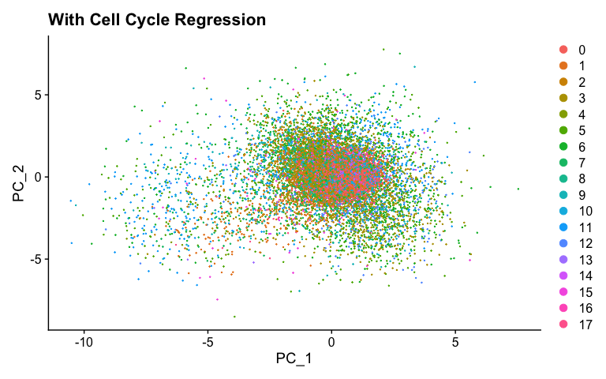

D14 ventral scRNAseq data analysis
================
chirag parsania
11/20/2020

### Load libraries

``` r
library(Seurat)
library(tidyverse)
```

### Read the raw data

Read the raw data using R package Seurat3.2 and create a Seurat object
with at least 200 genes in each cell.

``` r
## load data 
d14_ventral_cdna.data <- Seurat::Read10X(data.dir = "../../data/")
```

### Initialize seurat object with at least 200 genes in each cell

``` r
d14_ventral_cdna.seurat <- CreateSeuratObject(counts = d14_ventral_cdna.data, 
                           project = "Day14_Ventral_cDNA", 
                           min.features = 200)
```

### QC

Remove cells expressing more than 10% mitochondrial genes and cells
expressing genes more than 2.5 times of average number of genes
expressed in dataset

``` r
## identify  mito genes (start with "MT-")
d14_ventral_cdna.seurat[["percent.mt"]] <- PercentageFeatureSet(d14_ventral_cdna.seurat, pattern = "^MT-")
head(d14_ventral_cdna.seurat@meta.data, 5)
```

    ##                            orig.ident nCount_RNA nFeature_RNA percent.mt
    ## AAACCCAAGATTGCGG-1 Day14_Ventral_cDNA      13457         3744   4.428922
    ## AAACCCAAGCATCTTG-1 Day14_Ventral_cDNA      12720         3616   4.756289
    ## AAACCCAAGCTGAGTG-1 Day14_Ventral_cDNA      14235         4130   4.271163
    ## AAACCCAAGGGTACGT-1 Day14_Ventral_cDNA      20156         5095   5.129986
    ## AAACCCAAGTAGTCAA-1 Day14_Ventral_cDNA      24482         5036   3.373907

``` r
## plot feature counts
VlnPlot(d14_ventral_cdna.seurat, features = c("nFeature_RNA", "nCount_RNA", "percent.mt"), ncol = 3)
```

<!-- -->

``` r
## get average of each variable in meta data 
meta_data_avg <- d14_ventral_cdna.seurat@meta.data %>% 
        tibble::as_tibble() %>% 
        dplyr::summarise_if(is.numeric , mean)

meta_data_avg
```

    ## # A tibble: 1 x 3
    ##   nCount_RNA nFeature_RNA percent.mt
    ##        <dbl>        <dbl>      <dbl>
    ## 1     15132.        3949.       4.84

``` r
## per cell average feature  
avg_nFeature_RNA <- meta_data_avg %>% 
        dplyr::pull(nFeature_RNA)

avg_nFeature_RNA
```

    ## [1] 3948.872

``` r
## remove cells expressing more than 10% mitochondrial genes and 
## cells expressing genes more than 2.5 times of average number of genes expressed in dataset

d14_ventral_cdna.seurat <- subset(d14_ventral_cdna.seurat, 
                                  subset = nFeature_RNA < (avg_nFeature_RNA * 2.5) & percent.mt < 10)

## Number of cells remained once filtered with above criteria 
glue::glue("Cells remained : {d14_ventral_cdna.seurat %>% dim %>% .[2]}")
```

    ## Cells remained : 16052

### Perform normalisation and scale data matrix

``` r
## normalization 
d14_ventral_cdna.seurat <- NormalizeData(d14_ventral_cdna.seurat, 
                                         normalization.method = "LogNormalize", 
                                         scale.factor = 10000)

## find highly variable features
d14_ventral_cdna.seurat <- FindVariableFeatures(d14_ventral_cdna.seurat, 
                                                selection.method = "vst", 
                                                nfeatures = 2000)

## top 10 features 
head(VariableFeatures(d14_ventral_cdna.seurat), 10)
```

    ##  [1] "NEFM"   "STMN2"  "CHGA"   "GAP43"  "COL3A1" "GATA2"  "TAGLN"  "SST"   
    ##  [9] "NRN1"   "DCN"

``` r
## scale variable features
d14_ventral_cdna.seurat <- ScaleData(d14_ventral_cdna.seurat, 
                                     features = VariableFeatures(d14_ventral_cdna.seurat))
```

### Dimension reduction

Run PCA analysis and determine optimal number of PCs suitable to perform
clustering.

``` r
## run PCA using variable features 
d14_ventral_cdna.seurat <- RunPCA(d14_ventral_cdna.seurat, 
                                  features = VariableFeatures(d14_ventral_cdna.seurat))

DimPlot(d14_ventral_cdna.seurat, reduction = "pca")
```

<!-- -->

### Primary source of heterogenety

Have a look into top features which primarily contributes to the
variability defined by each PC.

``` r
DimHeatmap(d14_ventral_cdna.seurat, dims = 1:20, cells = 500, balanced = TRUE)
```

<!-- -->

### Find optimum PC

``` r
## find optimum PCs with elbow plot 

elb_plt <- ElbowPlot(d14_ventral_cdna.seurat,ndims = 50) 
elb_plt + geom_vline(xintercept = 16)
```

<!-- -->

As marked by vertical line, elbow is created somewhere between PC no. 14
and 18.

## Cell clustering

Cluster cells based upon previously identified optimum PCs and visualize
them in UMAP plot. Here, number of optimum PCs are set to 16.

``` r
## find neighbors

num_of_pc = 16

d14_ventral_cdna.seurat <- FindNeighbors(d14_ventral_cdna.seurat, 
                                         dims = 1:num_of_pc,
                                         reduction = "pca")
## find clusters
d14_ventral_cdna.seurat <- FindClusters(d14_ventral_cdna.seurat, resolution =0.6)
```

    ## Modularity Optimizer version 1.3.0 by Ludo Waltman and Nees Jan van Eck
    ## 
    ## Number of nodes: 16052
    ## Number of edges: 526299
    ## 
    ## Running Louvain algorithm...
    ## Maximum modularity in 10 random starts: 0.8903
    ## Number of communities: 18
    ## Elapsed time: 3 seconds

``` r
## non linear dimensional reduction UMAP

d14_ventral_cdna.seurat <- RunUMAP(d14_ventral_cdna.seurat , dims = 1:num_of_pc)
dim_plot <- DimPlot(d14_ventral_cdna.seurat, reduction = "umap",label = T)
dim_plot + ggtitle(glue::glue("No. of PCs : {num_of_pc}"))
```

<!-- -->

### UMAP plots for different number of PCs.

To check whether the number of clusters affected by the choice of
optimum PCs, I run clustering followed by visualization through UMAP
plot for multiple choices of optimum PCs.

``` r
## check number of clusters with different choices of optimum PCs.  

num_of_pcs <- seq(10,20, by =2 )
umap_plots <- purrr::map(num_of_pcs , function(x){
        d14_ventral_cdna.seurat <- FindNeighbors(d14_ventral_cdna.seurat, dims = 1:x)
        d14_ventral_cdna.seurat <- FindClusters(d14_ventral_cdna.seurat, resolution = 0.6)
        d14_ventral_cdna.seurat <- RunUMAP(d14_ventral_cdna.seurat, dims = 1:x)
        dim_plot <- DimPlot(d14_ventral_cdna.seurat, reduction = "umap",label = T)
        dim_plot + ggtitle(glue::glue("No. of PCs : {x}"))
})
```

    ## Modularity Optimizer version 1.3.0 by Ludo Waltman and Nees Jan van Eck
    ## 
    ## Number of nodes: 16052
    ## Number of edges: 509711
    ## 
    ## Running Louvain algorithm...
    ## Maximum modularity in 10 random starts: 0.8891
    ## Number of communities: 16
    ## Elapsed time: 3 seconds
    ## Modularity Optimizer version 1.3.0 by Ludo Waltman and Nees Jan van Eck
    ## 
    ## Number of nodes: 16052
    ## Number of edges: 518274
    ## 
    ## Running Louvain algorithm...
    ## Maximum modularity in 10 random starts: 0.8877
    ## Number of communities: 15
    ## Elapsed time: 2 seconds
    ## Modularity Optimizer version 1.3.0 by Ludo Waltman and Nees Jan van Eck
    ## 
    ## Number of nodes: 16052
    ## Number of edges: 522194
    ## 
    ## Running Louvain algorithm...
    ## Maximum modularity in 10 random starts: 0.8904
    ## Number of communities: 17
    ## Elapsed time: 2 seconds
    ## Modularity Optimizer version 1.3.0 by Ludo Waltman and Nees Jan van Eck
    ## 
    ## Number of nodes: 16052
    ## Number of edges: 526299
    ## 
    ## Running Louvain algorithm...
    ## Maximum modularity in 10 random starts: 0.8903
    ## Number of communities: 18
    ## Elapsed time: 3 seconds
    ## Modularity Optimizer version 1.3.0 by Ludo Waltman and Nees Jan van Eck
    ## 
    ## Number of nodes: 16052
    ## Number of edges: 534895
    ## 
    ## Running Louvain algorithm...
    ## Maximum modularity in 10 random starts: 0.8901
    ## Number of communities: 18
    ## Elapsed time: 3 seconds
    ## Modularity Optimizer version 1.3.0 by Ludo Waltman and Nees Jan van Eck
    ## 
    ## Number of nodes: 16052
    ## Number of edges: 541400
    ## 
    ## Running Louvain algorithm...
    ## Maximum modularity in 10 random starts: 0.8901
    ## Number of communities: 19
    ## Elapsed time: 3 seconds

``` r
## arrange UMAP plot
ggpubr::ggarrange(umap_plots[[1]] + theme(legend.position = "none"),
                  umap_plots[[2]] + theme(legend.position = "none"),
                  umap_plots[[3]]+ theme(legend.position = "none"),
                  umap_plots[[4]]+ theme(legend.position = "none"),
                  umap_plots[[5]]+ theme(legend.position = "none"),
                  umap_plots[[6]]+ theme(legend.position = "none"))
```

<!-- -->
Number of clusters does not change dramatically with number of PCs - 16,
18 and 20. Further, elbow plot also suggests choice of optimum PCs in
between 14 - 18. Therefore, it is reasonable to select number of optimum
PCs to 16.

### Find top markers of each cluster

``` r
## find top markers of each cluster 
top.markers <- FindAllMarkers(d14_ventral_cdna.seurat, 
                              only.pos = TRUE, 
                              min.pct = 0.25, 
                              logfc.threshold = 0.25)

## visualize top marker of each cluster in umap plot

top.markers.1 <- top.markers %>% 
        tibble::rownames_to_column() %>% 
        tibble::as_tibble() %>% 
        dplyr::group_by(cluster) %>% 
        dplyr::arrange(-avg_logFC) %>% 
        slice(1)

fp <- FeaturePlot(d14_ventral_cdna.seurat , features = top.markers.1$gene )
fp
```

<!-- -->

### Cell cycle regression

In the single cell RNA-seq data cellular heterogeneity comes from cell
cycle besides primary source of heterogeneity. One of the ways to
mitigate the effect of cell cycle heterogeneity is cell cycle regression
analysis. In this analysis, each cell is assigned with cell cycle phase
score depending upon the gene expression profile of well established
cell cycle marker genes. Here, I used genes of S phase and G2M phase as
cell cycle marker. Further, method also tries to predict state of cell
cycle phase from the score assigned to each cell.

Once I regress the effect of cell cycle marker genes from the data, the
effect of cell cycle heterogeneity will be nullified. This can be
confirmed by the PCA analysis performed by cell cycle marker genes with
and without regressing them from the scaled data.

``` r
## given cell cycle marker genes 
s.genes <- c("MCM5", "PCNA", "TYMS", "FEN1", "MCM2", "MCM4", "RRM1", "UNG", "GINS2", "MCM6", "CDCA7", "DTL", "PRIM1", "UHRF1", "MLF1IP", "HELLS", "RFC2", "RPA2", "NASP", "RAD51AP1", "GMNN", "WDR76", "SLBP", "CCNE2", "UBR7", "POLD3", "MSH2", "ATAD2", "RAD51", "RRM2", "CDC45", "CDC6", "EXO1", "TIPIN", "DSCC1", "BLM", "CASP8AP2", "USP1", "CLSPN", "POLA1", "CHAF1B", "BRIP1", "E2F8")
g2m.genes <- c("HMGB2", "CDK1", "NUSAP1", "UBE2C", "BIRC5", "TPX2", "TOP2A", "NDC80", "CKS2", "NUF2", "CKS1B", "MKI67", "TMPO", "CENPF", "TACC3", "FAM64A", "SMC4", "CCNB2", "CKAP2L", "CKAP2", "AURKB", "BUB1", "KIF11", "ANP32E", "TUBB4B", "GTSE1", "KIF20B", "HJURP", "CDCA3", "HN1", "CDC20", "TTK", "CDC25C", "KIF2C", "RANGAP1", "NCAPD2", "DLGAP5", "CDCA2", "CDCA8", "ECT2", "KIF23", "HMMR", "AURKA", "PSRC1", "ANLN", "LBR", "CKAP5", "CENPE", "CTCF", "NEK2", "G2E3", "GAS2L3", "CBX5", "CENPA")

## perform cell cycle scoring  
d14_ventral_cdna.seurat <- CellCycleScoring(d14_ventral_cdna.seurat, 
                                            s.features = s.genes, 
                                            g2m.features = g2m.genes, 
                                            set.ident = FALSE)


## scale data without cell cycle regression 
d14_ventral_cdna.seurat <- ScaleData(d14_ventral_cdna.seurat)

## PCA with cell cycle features 
d14_ventral_cdna.seurat <- RunPCA(d14_ventral_cdna.seurat, features = c(s.genes, g2m.genes))
DimPlot(d14_ventral_cdna.seurat , reduction = "pca") + ggtitle("Without Cell Cycle Regression")
```

<!-- -->

``` r
## scale data  with cell cycle regression 
d14_ventral_cdna.seurat <- ScaleData(d14_ventral_cdna.seurat, vars.to.regress = c("S.Score", "G2M.Score"))

## PCA with cell cycle features 
d14_ventral_cdna.seurat <- RunPCA(d14_ventral_cdna.seurat, features = c(s.genes, g2m.genes))
DimPlot(d14_ventral_cdna.seurat , reduction = "pca") + ggtitle("With Cell Cycle Regression")
```

<!-- -->

We can see here that when PCA was run with cell cycle regression
applied, cells no more separates in multiple clusters suggesting that
cellular heterogeneity lost which were there from cell cycle markers.
